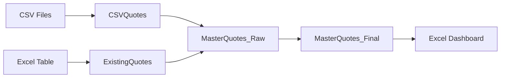

# SQRCT System Architecture

## Table of Contents

1. [Introduction](#1-introduction)
2. [System Overview](#2-system-overview)
3. [Repository Structure](#3-repository-structure)
4. [Component Architecture](#4-component-architecture)
5. [Data Flow](#5-data-flow)
6. [Data Models](#6-data-models)
7. [Module Descriptions](#7-module-descriptions)
8. [Error Handling](#8-error-handling)
9. [Security Considerations](#9-security-considerations)
10. [Deployment & Operations](#10-deployment--operations)
11. [Performance Considerations](#11-performance-considerations)
12. [Future Enhancements](#12-future-enhancements)

## 1. Introduction

This document provides a comprehensive technical architecture overview of the SQRCT (Strategic Quote Recovery & Conversion Tracker) system. It is designed to be AI-friendly and provide clear context for developers and automated coding assistants.

### Purpose

SQRCT tracks sales quotes through their lifecycle, automating follow-up stage calculations and enabling team collaboration through a multi-user Excel-based system with centralized synchronization.

### Key Design Principles

- **Modularity**: Separated concerns between data processing, UI, and synchronization
- **Data Integrity**: Timestamp-based conflict resolution ensures data consistency
- **User Autonomy**: Individual workbooks allow independent operation
- **Automation**: Power Query handles data processing without manual intervention
- **Traceability**: All user edits are logged with timestamps and attribution

## 2. System Overview

### High-Level Architecture

```
┌─────────────────────────────────────────────────────────────────┐
│                           SQRCT System                           │
├─────────────────────────┬───────────────────┬──────────────────┤
│   Data Layer (PQ)       │   Logic Layer     │   Sync Layer     │
├─────────────────────────┼───────────────────┼──────────────────┤
│ • CSV Ingestion         │ • Dashboard Mgmt  │ • File Reading   │
│ • Data Transformation   │ • View Generation │ • Conflict Res   │
│ • Stage Calculation     │ • Edit Capture    │ • Data Writing   │
│ • Deduplication         │ • Validation      │ • Logging        │
└─────────────────────────┴───────────────────┴──────────────────┘
```

### System Components

1. **User Workbooks** (Ryan.xlsm, Ally.xlsm)
   - Individual Excel files for each team member
   - Contains full VBA logic and Power Query
   - Maintains local UserEdits sheet

2. **Master Workbook** (Master.xlsm)
   - Central repository for consolidated data
   - Target for synchronization operations
   - Source of truth for reporting

3. **SyncTool Workbook** (SyncTool.xlsm)
   - Standalone synchronization utility
   - Reads from all workbooks
   - Writes only to Master

## 3. Repository Structure

```
SQRCT/
├── src/
│   ├── vba/
│   │   ├── core/                    # Shared VBA modules
│   │   │   ├── modArchival.bas      # Active/Archive view management
│   │   │   ├── modFormatting.bas    # UI formatting functions
│   │   │   ├── modUtilities.bas     # Utility functions and validation
│   │   │   └── modPerformanceDashboard.bas  # Performance metrics
│   │   └── workbooks/               # Workbook-specific VBA
│   │       ├── ally/                # Ally's workbook modules
│   │       ├── master/              # Master workbook modules
│   │       ├── ryan/                # Ryan's workbook modules
│   │       └── sync_tool/           # SyncTool modules
│   └── power_query/                 # Power Query M scripts
│       ├── Query - CSVQuotes.pq     # CSV ingestion
│       ├── Query - ExistingQuotes.pq # Historical data
│       ├── Query - MasterQuotes_Raw.pq # Data combination
│       └── Query - MasterQuotes_Final.pq # Final processing
├── docs/
│   ├── ARCHITECTURE.md              # This file
│   └── updates/                     # Project history
└── archives/                        # Historical files
```

## 4. Component Architecture

### 4.1 Power Query Pipeline

The Power Query pipeline is the data ingestion and transformation layer:



**Key Queries:**

1. **CSVQuotes.pq**
   - Reads daily CSV exports from network location
   - Handles encoding and delimiter issues
   - Standardizes column names and types

2. **ExistingQuotes.pq**
   - Loads historical data from Excel table
   - Maintains data continuity across refreshes

3. **MasterQuotes_Raw.pq**
   - Combines CSV and historical data
   - Removes duplicates based on Date Pulled

4. **MasterQuotes_Final.pq**
   - Core processing logic:
     - Groups by Document Number
     - Calculates occurrence count
     - Determines AutoStage based on rules
     - Identifies missing quotes
     - Applies business logic for stage selection

### 4.2 VBA Architecture

The VBA layer handles user interface and business logic:

```
Module_Dashboard
    ├── RefreshDashboard()
    │   ├── SaveUserEditsFromDashboard()
    │   ├── BuildDashboardDataArray()
    │   ├── ApplyFormatting()
    │   └── RefreshAllViews()
    ├── Button Handlers
    └── Helper Functions

modArchival
    ├── RefreshActiveView()
    ├── RefreshArchiveView()
    ├── CopyFilteredRows()
    └── ApplyViewFormatting()

modUtilities
    ├── GetPhaseFromPrefix()
    ├── ApplyPhaseValidation()
    └── UpdateAllViewCounts()
```

### 4.3 Synchronization Architecture

The SyncTool manages data consolidation:

```
SyncTool_Manager
    ├── StartSynchronization()
    │   ├── ValidateFilePaths()
    │   ├── ExtractAllUserEdits()
    │   ├── DetectConflicts()
    │   ├── ResolveConflicts()
    │   └── WriteMergedData()
    └── Helper Functions

Conflict_Handler
    ├── DetectConflicts()
    ├── ResolveByTimestamp()
    └── MergeComments()
```

## 5. Data Flow

### 5.1 Primary Data Pipeline

```
CSV Files → Power Query → Dashboard → User Edits → SyncTool → Master
```

### 5.2 Detailed Flow Steps

#### Step 1: Data Ingestion (Power Query)
```
1. CSVQuotes reads new quotes from network path
2. ExistingQuotes loads historical data
3. MasterQuotes_Raw combines both sources
4. MasterQuotes_Final applies transformations:
   - Filters excluded users
   - Groups by Document Number
   - Calculates stage and occurrence
   - Selects final row per document
5. Output loaded to Excel table
```

#### Step 2: Dashboard Refresh (VBA)
```
1. User clicks "Standard Refresh"
2. Current edits saved to UserEdits sheet
3. Power Query refreshes data
4. Dashboard rebuilt with merged data:
   - Columns A-J from Power Query
   - Columns K-N from UserEdits
5. Views regenerated (Active/Archive)
6. Formatting and protection applied
```

#### Step 3: User Edit Capture
```
1. User modifies columns K-N
2. Worksheet_Change event fires
3. Edit captured with:
   - Document Number (key)
   - Changed values
   - User identity
   - Timestamp
4. Data written to UserEdits sheet
```

#### Step 4: Synchronization
```
1. SyncTool opened by admin
2. File paths validated
3. UserEdits extracted from all workbooks
4. Conflicts detected and displayed
5. Resolution applied (timestamp priority)
6. Merged data written to Master only
```

## 6. Data Models

### 6.1 MasterQuotes_Final Structure

| Column | Type | Description |
|--------|------|-------------|
| First Date Pulled | Date | Earliest quote appearance |
| Document Number | Text | Unique quote identifier |
| Document Date | Date | Quote creation date |
| Customer Number | Text | Customer identifier |
| Customer Name | Text | Customer company name |
| User To Enter | Text | Assigned salesperson |
| Document Amount | Currency | Quote value |
| Salesperson ID | Text | Sales rep code |
| Pull Count | Number | Occurrence count |
| Historic Stage | Text | Previous stage value |
| AutoStage | Text | Calculated stage |
| AutoNote | Text | System-generated notes |
| IsMissing | Boolean | Not in latest pull |
| DataSource | Text | CSV or Legacy |

### 6.2 UserEdits Structure

| Column | Type | Description |
|--------|------|-------------|
| A: DocNumber | Text | Document Number (key) |
| B: Phase | Text | Engagement Phase |
| C: LastContact | Date | Last contact date |
| D: Email | Text | Email contact |
| E: Comments | Text | User comments |
| F: Source | Text | RZ/AF/MASTER |
| G: Timestamp | DateTime | Edit timestamp |

### 6.3 Dashboard Columns

| Range | Purpose | Editable |
|-------|---------|----------|
| A-J | Power Query data | No (Protected) |
| K | Engagement Phase | Yes (Dropdown) |
| L | Last Contact Date | Yes |
| M | Email Contact | Yes |
| N | User Comments | Yes |

## 7. Module Descriptions

### 7.1 Core Modules (Shared)

#### modArchival.bas
**Purpose**: Manages Active and Archive view generation
**Key Functions**:
- `RefreshActiveView()`: Creates filtered view of active quotes
- `RefreshArchiveView()`: Creates filtered view of completed quotes
- `IsPhaseArchived()`: Determines if quote should be archived
- `ApplyViewFormatting()`: Consistent formatting across views

#### modUtilities.bas
**Purpose**: Shared utility functions
**Key Functions**:
- `GetPhaseFromPrefix()`: Phase validation and auto-complete
- `ApplyPhaseValidation()`: Sets up dropdown validation
- `UpdateAllViewCounts()`: Updates dashboard counters

#### modFormatting.bas
**Purpose**: UI formatting functions
**Key Functions**:
- `ApplyStandardFormatting()`: Base formatting rules
- `ApplyConditionalFormatting()`: Color coding rules
- `FormatControlRow()`: Row 2 control formatting

### 7.2 Workbook-Specific Modules

#### Module_Dashboard.bas (User Workbooks)
**Purpose**: Main dashboard logic
**Key Functions**:
- `RefreshDashboard()`: Complete dashboard refresh
- `SaveUserEditsFromDashboard()`: Persists edits
- `BuildDashboardDataArray()`: Merges data sources
- `ProtectUserColumns()`: Sheet protection

#### Module_Identity.bas
**Purpose**: Identifies workbook owner
**Constants**:
- `WORKBOOK_IDENTITY`: "RZ", "AF", or "MASTER"

### 7.3 SyncTool Modules

#### Module_SyncTool_Manager.bas
**Purpose**: Orchestrates synchronization
**Key Functions**:
- `StartSynchronization()`: Main sync entry point
- `GetValidatedFilePaths()`: Path validation

#### Module_Conflict_Handler.bas
**Purpose**: Conflict resolution logic
**Key Functions**:
- `DetectConflicts()`: Identifies discrepancies
- `ResolveConflicts()`: Applies resolution rules
- `MergeUserEdits()`: Combines all sources

## 8. Error Handling

### 8.1 Error Handling Strategy

```vba
' Standard error handling pattern
Public Sub ExampleProcedure()
    On Error GoTo ErrorHandler
    
    ' Main logic here
    
    Exit Sub
    
ErrorHandler:
    ' Log error
    DebugLog "Error in ExampleProcedure: " & Err.Description
    ' Clean up resources
    ' Display user message if appropriate
End Sub
```

### 8.2 Error Types and Responses

| Error Type | Response |
|------------|----------|
| File not found | Prompt user to verify path |
| Permission denied | Check file locks, prompt retry |
| Data type mismatch | Log error, skip record |
| Network unavailable | Retry with exponential backoff |
| Validation failure | Show user message, undo change |

## 9. Security Considerations

### 9.1 Access Control
- File system permissions control workbook access
- VBA project password protection (optional)
- Sheet protection with blank password (PW_WORKBOOK = "")

### 9.2 Data Security
- No credentials stored in code
- Network paths should use environment variables
- Audit trail maintained via UserEdits timestamps

### 9.3 Best Practices
- Regular backups of all workbooks
- Version control for code modules
- Testing in isolated environment

## 10. Deployment & Operations

### 10.1 Deployment Process

1. **Code Export**
   - Export VBA modules from development workbook
   - Commit to Git repository
   - Tag release version

2. **Code Import**
   - Open production workbooks
   - Remove old modules
   - Import new modules from repository
   - Save and test

3. **Power Query Updates**
   - Export M code to .pq files
   - Update in Power Query Editor
   - Refresh data connections

### 10.2 Operational Procedures

**Daily Operations:**
1. Morning: Users refresh dashboards
2. Throughout day: Users update engagement data
3. End of day: Admin runs synchronization

**Weekly Maintenance:**
1. Verify data integrity
2. Check error logs
3. Archive old quotes if needed

**Monthly Tasks:**
1. Performance review
2. User feedback collection
3. Code optimization as needed

## 11. Performance Considerations

### 11.1 Optimization Strategies

1. **Power Query**
   - Table.Buffer() for frequently accessed data
   - Minimize data type conversions
   - Filter early in the pipeline

2. **VBA**
   - Use arrays instead of cell-by-cell operations
   - Disable screen updating during refresh
   - Implement dictionary lookups for large datasets

3. **File Size**
   - Regular cleanup of historical data
   - Compress images if present
   - Remove unused named ranges

### 11.2 Performance Metrics

| Operation | Target Time | Actual Time |
|-----------|------------|-------------|
| Dashboard Refresh | < 30 seconds | ~20 seconds |
| View Generation | < 5 seconds | ~3 seconds |
| Synchronization | < 1 minute | ~45 seconds |

## 12. Future Enhancements

### 12.1 Planned Improvements

1. **Automation**
   - Scheduled Power Query refresh
   - Automatic synchronization
   - Email notifications for stages

2. **Features**
   - Advanced filtering options
   - Custom report generation
   - Mobile view (Power BI)

3. **Technical Debt**
   - Migrate to class modules
   - Implement unit testing
   - Add comprehensive logging

### 12.2 Architecture Evolution

**Phase 1** (Current): Excel-based with manual sync
**Phase 2**: Add SQL Server backend
**Phase 3**: Web-based interface
**Phase 4**: Full CRM integration

---

*Last Updated: August 2025 | Version 4.0.0*