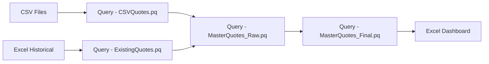

# SQRCT Source Code Directory

**Last Updated:** 2025-08-10  
**Version:** 4.0.0  
**Directory:** `/src/`

## Overview

This directory contains all source code for the SQRCT (Strategic Quote Recovery & Conversion Tracker) system. The architecture follows a modular design with clear separation between the main application, VBA business logic, and Power Query data processing components.

## Main Entry Point

### 🚀 Primary Application Entry Point

**File:** `SQRCT_Main.xlsm`  
**Type:** Excel Workbook with VBA Macros and Power Query  
**Purpose:** Main SQRCT application for strategic quote recovery and conversion tracking

#### How to Launch:
1. Open `SQRCT_Main.xlsm` in Microsoft Excel 2016 or later
2. Enable macros when prompted (ensure file is in trusted location)
3. The main dashboard will load automatically
4. Click "Standard Refresh" to load latest quote data

#### Dependencies:
- All VBA modules in `/src/vba/`
- All Power Query scripts in `/src/power_query/`
- Network access to CSV data sources
- Proper Excel macro and Power Query configuration

---

## Source Code Structure

```
src/
├── SQRCT_Main.xlsm                 # 🚀 MAIN ENTRY POINT
├── vba/                            # VBA modules (business logic)
│   ├── core/                       # Shared modules (required by all workbooks)
│   └── workbooks/                  # Workbook-specific implementations
└── power_query/                    # Power Query M scripts (data processing)
```

---

## VBA Module Architecture

### Core Modules (`/src/vba/core/`)

These modules must be imported into every Excel workbook:

| Module | Purpose | Key Functions |
|--------|---------|---------------|
| `modUtilities.bas` | Foundation utilities and validation | `GetPhaseFromPrefix()`, `ApplyPhaseValidation()` |
| `modFormatting.bas` | UI formatting and styling | `ApplyStandardFormatting()`, `ModernButton()` |
| `modArchival.bas` | Active/Archive view management | `RefreshActiveView()`, `RefreshArchiveView()` |
| `modPerformanceDashboard.bas` | Performance metrics tracking | Performance monitoring functions |

#### Module Dependencies:
```
modUtilities.bas (foundation - no dependencies)
├── modFormatting.bas (depends on modUtilities)
├── modArchival.bas (depends on modUtilities, modFormatting)
└── modPerformanceDashboard.bas (depends on modUtilities)
```

### Workbook-Specific Modules (`/src/vba/workbooks/`)

#### Individual User Workbooks

**`ally/`** - Ally's workbook modules:
- `Module_Dashboard.bas` - Dashboard logic for Ally's workbook
- `Module_Identity.bas` - Sets `WORKBOOK_IDENTITY = "AF"`
- `Sheet12 (SQRCT Dashboard).cls` - Sheet class with event handlers

**`ryan/`** - Ryan's workbook modules:
- `Module_Dashboard.bas` - Dashboard logic for Ryan's workbook  
- `Module_Identity.bas` - Sets `WORKBOOK_IDENTITY = "RZ"`
- `Sheet2 (SQRCT Dashboard).cls` - Sheet class with event handlers
- `ThisWorkbook.bas` - Workbook-level event handlers
- Additional core module copies for reference

**`master/`** - Master workbook modules:
- `Module1.bas` - Master workbook dashboard logic
- `Sheet2 (SQRCT Dashboard).cls` - Master sheet class

#### Synchronization Tool

**`sync_tool/`** - Multi-user synchronization system:
- `Module_SyncTool_Manager.bas` - 🔧 Main sync orchestration
- `Module_File_Processor.bas` - File reading/writing operations
- `Module_Conflict_Handler.bas` - Timestamp-based conflict resolution
- `Module_Constants.bas` - System constants and configuration
- Supporting utility modules for logging, UI, and error handling

---

## Power Query Data Pipeline

### Primary Data Flow (`/src/power_query/`)



#### Core Query Files:

| File | Purpose | Dependencies |
|------|---------|-------------|
| `Query - CSVQuotes.pq` | 📥 Ingests daily CSV exports | Network CSV path |
| `Query - ExistingQuotes.pq` | 📋 Loads historical Excel data | Excel table data |
| `Query - MasterQuotes_Raw.pq` | 🔄 Combines CSV + historical | Above 2 queries |
| `Query - MasterQuotes_Final.pq` | ✨ **CORE PROCESSOR** | MasterQuotes_Raw |

#### Supporting Queries:

| Category | Files | Purpose |
|----------|--------|---------|
| Document Tracking | `DocNum_LatestLocation.pq`, `Map_Form_DocNum.pq` | Document location mapping |
| Order Confirmation | `OrderConf_*.pq` (multiple files) | Order processing workflows |
| Client Data | `Query - CLIENT QUOTES.pg`, `Query - ExistingQuotes.pq` | Client-specific processing |

---

## Key Entry Points for Development

### 1. Dashboard Refresh Logic
**Location:** `src/vba/workbooks/*/Module_Dashboard.bas`  
**Main Function:** `RefreshDashboard()`  
**Purpose:** Orchestrates complete data refresh and UI update

```vba
Public Sub RefreshDashboard()
    ' 1. Save current user edits
    ' 2. Refresh Power Query data
    ' 3. Merge data sources
    ' 4. Update UI and formatting
    ' 5. Generate Active/Archive views
End Sub
```

### 2. Data Processing Pipeline
**Location:** `src/power_query/Query - MasterQuotes_Final.pq`  
**Purpose:** Core data transformation and business logic

```m
let
    // Data ingestion and combination
    // Stage calculation and deduplication  
    // Business rules application
    // Final output formatting
in
    ProcessedData
```

### 3. User Edit Handling
**Location:** `src/vba/workbooks/*/Sheet*.cls`  
**Event:** `Worksheet_Change`  
**Purpose:** Captures and persists user edits in real-time

### 4. Synchronization Entry Point
**Location:** `src/vba/workbooks/sync_tool/Module_SyncTool_Manager.bas`  
**Main Function:** `StartSynchronization()`  
**Purpose:** Consolidates edits from all user workbooks

---

## Development Workflow

### 1. Setting Up Development Environment

```bash
# 1. Ensure you have the proper Excel version
# Microsoft Excel 2016+ with Power Query and VBA support

# 2. Configure Excel for development
# File → Options → Trust Center → Trusted Locations
# Add the repository path as trusted

# 3. Open main entry point
# Open src/SQRCT_Main.xlsm
```

### 2. Making VBA Changes

```vba
' 1. Open VBA Editor (Alt+F11)
' 2. Locate module in Project Explorer
' 3. Make changes in editor
' 4. Test changes
' 5. Export module: Right-click → Export File
' 6. Commit exported .bas file to Git
' 7. Import to other workbooks as needed
```

### 3. Making Power Query Changes

```m
// 1. Data → Get Data → Launch Power Query Editor
// 2. Select query to modify
// 3. Make changes in Advanced Editor
// 4. Test with sample data
// 5. Close & Apply to save
// 6. Export M code to .pq file in repository
// 7. Commit .pq file to Git
```

### 4. Testing Changes

- **Unit Testing:** Test individual VBA functions
- **Integration Testing:** Test complete refresh workflow
- **Multi-User Testing:** Test synchronization scenarios
- **Performance Testing:** Verify acceptable refresh times

---

## Configuration and Customization

### Environment-Specific Settings

Key settings that need customization per environment:

| Setting | Location | Purpose |
|---------|----------|---------|
| CSV Data Path | Power Query sources | Network location of CSV exports |
| Workbook Paths | SyncTool configuration | Paths to individual user workbooks |
| User Identity | `Module_Identity.bas` | Workbook owner identification |
| Phase List | Named range `PHASE_LIST` | Valid engagement phases |
| Network Paths | VBA constants | Shared network locations |

### Customization Points

- **Phase Definitions:** Update `PHASE_LIST` named range
- **Validation Rules:** Modify `modUtilities.bas` validation functions
- **UI Styling:** Customize `modFormatting.bas` formatting functions
- **Business Logic:** Update stage calculation in `Query - MasterQuotes_Final.pq`
- **Sync Frequency:** Configure in SyncTool dashboard

---

## Security Considerations

### VBA Security
- All modules use `Option Explicit` for variable safety
- Error handling implemented in all public procedures
- No hardcoded credentials in source code
- Input validation for all user-editable data

### Data Security
- User edits tracked with timestamps and attribution
- File-level permissions control access
- Network paths use environment variables where possible
- Audit trail maintained for all data modifications

---

## Performance Optimization

### VBA Performance
- Array-based operations instead of cell-by-cell processing
- Dictionary lookups for large data sets
- Screen updating disabled during refresh
- Memory cleanup after large operations

### Power Query Performance
- Early filtering in data pipeline
- Minimized data type conversions
- Efficient query folding where possible
- Table.Buffer() for frequently accessed data

---

## Troubleshooting Guide

### Common Development Issues

**"Compile Error: Module Not Found"**
- Ensure all core modules are imported
- Check module name references in code
- Verify module dependencies are satisfied

**"Power Query Data Source Error"**
- Check network connectivity to CSV sources
- Verify file permissions on data sources
- Confirm query syntax and data types

**"Object Required Error in VBA"**
- Check object variable initialization
- Verify worksheet and range references
- Ensure proper error handling

### Debugging Tools

- **VBA:** Use `Debug.Print` and Immediate Window
- **Power Query:** Use Query Dependencies view
- **Data Flow:** Check intermediate query results
- **Performance:** Monitor refresh times and memory usage

---

## Next Steps for New Developers

1. **📖 Read Documentation:** Start with main `README.md` and `docs/ARCHITECTURE.md`
2. **🔧 Setup Environment:** Follow `docs/DEPLOYMENT.md` setup instructions  
3. **👀 Explore Code:** Browse VBA modules and Power Query scripts
4. **🧪 Run Tests:** Execute test procedures to understand functionality
5. **📋 Review Issues:** Check any open issues or enhancement requests
6. **💬 Ask Questions:** Reach out to development team for clarification

---

*This source code directory represents a well-architected, modular system that balances functionality with maintainability. The clear entry points and documentation make it accessible for both current maintenance and future enhancement.*